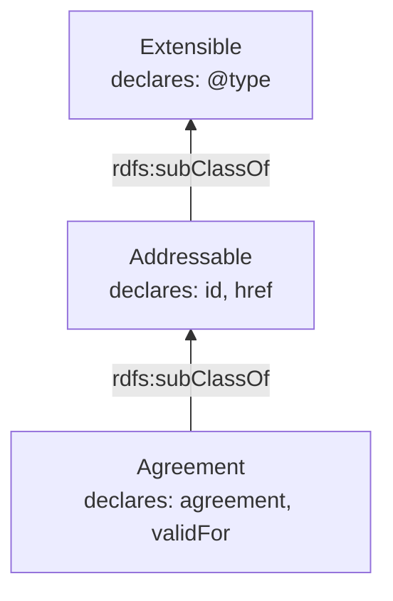
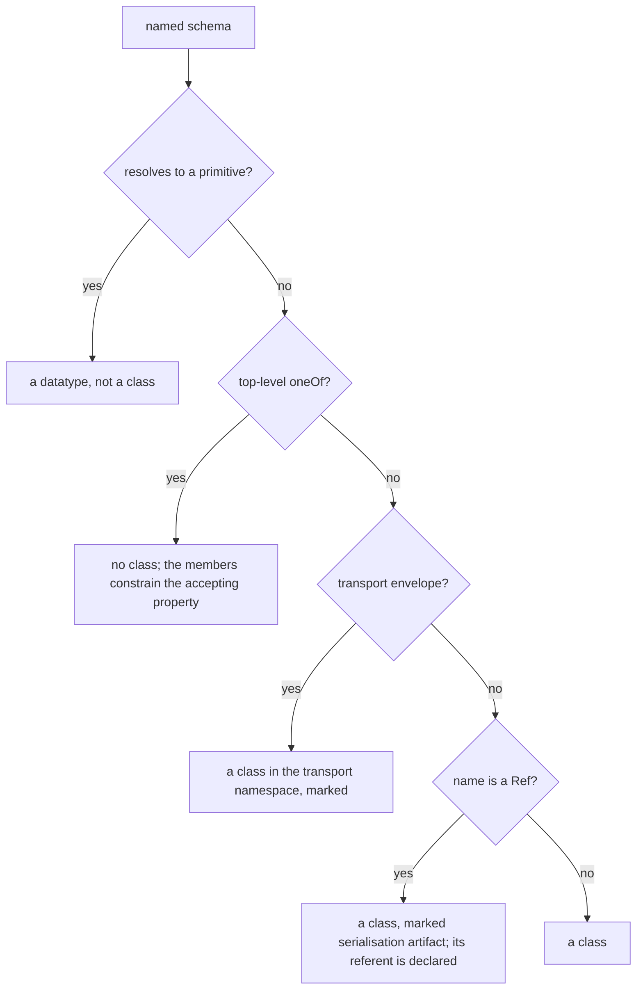
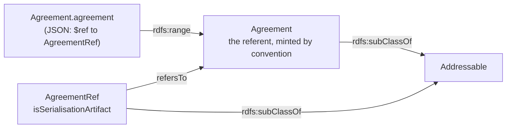
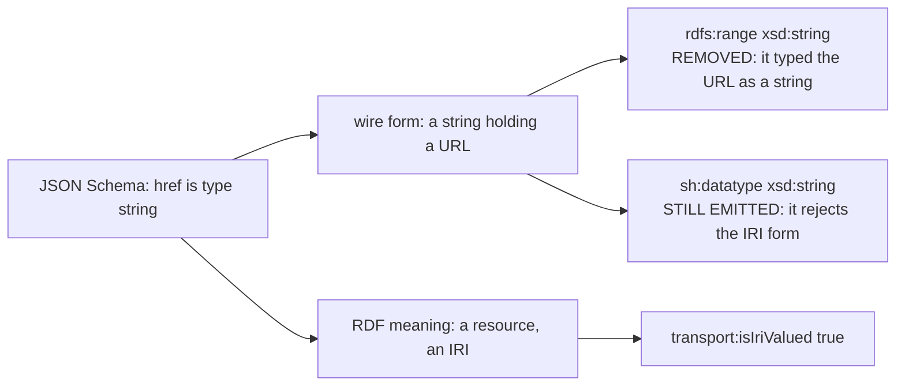

# 2. The vocabulary and the shapes, and the line between them

These two projections are treated together because the interesting question is not how either works
but **which facts go into which**, and that question has one answer with a reason.

## 2.1 Entailment versus validation

`rdfs:range` and `rdfs:domain` are not constraints. Under RDF Schema entailment they are *inference
rules*: `p rdfs:range C` together with `s p o` entails `o rdf:type C`, whether or not anyone intended
it. SHACL, by contrast, binds without entailing — a shape describes what conforming data looks like
and infers nothing.

So the rule this tool follows:

> **An RDFS axiom is emitted only where it is provably true. Everything else is expressed in SHACL,
> which constrains without asserting.**

An invented range is not a loose constraint. It is a false statement that propagates.

Two measured consequences of getting this wrong, both found only because a corpus with the right shape
was added:

**Multi-valued range.** A class-scoped property IRI can be reached more than once — a polymorphic
`oneOf`, or the same property resolved through two branches — and `rdflib`'s `Graph.add` is a set
insert, so two visits silently leave two ranges behind. That entails the value instantiates *both*
classes. Measured: **167 of 2,895 TM Forum properties (5.8%) against 6 of 3,622 on 3GPP (0.17%)**. The
guard had been written and validated against 3GPP, where polymorphic references are rare.

**Multi-valued domain.** Worse, because it is a false axiom about the *subject*. When a subclass
restates an inherited field, the emission site is reached once per restating subclass with the same
property IRI and a different domain. Measured: `Addressable#href` carried **12** domains and
`Event#event` carried **25** — entailing that every node with an `href` was simultaneously an
`Addressable`, an `EntityRef`, a `GeographicLocation`, a `PolicyRef` and a `ServiceOrder`. **28 of
2,895 TM Forum properties against 0 of 3,622 on 3GPP**, because 3GPP does not restate inherited fields.

Both are now enforced rather than documented, and the enforcement is what the earlier comments only
claimed.

## 2.2 Declaring-class attribution

A property belongs to the **highest ancestor that declares it**, not to the leaf class that mentions
it. In the worked example, `href` is declared by `Addressable`; an `Agreement` inherits it through
`rdfs:subClassOf` and does not redeclare it.



This is a modelling decision and it was tested against an independently-authored reference TBox rather
than asserted: declaring attribution resolved **93.9%** of `(class, property)` pairs where leaf
attribution resolved **68.5%**. The lower figure was an artifact of the instrument, not a gap in the
reference model.

*(Provenance: measured in `snm-api-native` against its own reference TBox. No committed script in this
repository reproduces it — see `99-appendix.md`.)*

The rule has a corollary that took three attempts to get right, and it is the subject of §2.5: **every
triple about a property must be derived from the schema that declares it**, never from a descendant
that restates it.

## 2.3 What becomes a class, and what does not

Not every named schema is a class, and the exclusions carry the argument.



**A primitive alias is a datatype, not a class.** `uri-Type: {type: string, format: uri}` names a
datatype. Minting a class for it produces a term no payload can instantiate.

**A `oneOf` union gets no class at all.** A named schema whose body is a `oneOf` is a JSON Schema
workaround for two things RDF does not need: *serialisation* (embed the entity, or point at it) and
*taxonomy* (enumerate the subclasses of a common ancestor, because JSON Schema cannot say "any subclass
of X"). Neither is a new kind of thing. TM Forum's own `discriminator` maps `@type` to a *member* and
never to the wrapper, so no conforming payload can select it. **Observed**: emitting one produced 14
unreachable classes and 14 unreachable context terms.

The test is on the `oneOf` **shape**, not on the name. A name test (`endswith("RefOrValue")`) missed
`PartyRefOrPartyRoleRef` and minted a referent called `PartyRefOrPartyRole`, which names nothing in any
TM Forum document.

What the union genuinely carries is a constraint on the *property* that accepts it, and that is
preserved: the union expands into its members, which the SHACL projection emits as `sh:or`/`sh:xone`.

**A `*Ref` keeps its class but is not a range target.** See §2.4.

**A transport envelope is classified, never dropped.** Notification wrappers, event payloads and JSON
Patch documents are wire plumbing rather than domain concepts. They are flagged, minted under a
separate namespace, and left in. Excluding them outright broke nesting: **observed** on TMF641's
`ServiceOrderCreateEvent`, the inner `ServiceOrder` lifted **76 triples standalone and 1 through the
envelope**, because the intermediate properties had no terms and the path to the domain object was
gone. Omission is not the safe option; a consumer wanting a pure domain ontology filters on the marker.

## 2.4 References: the case where RDF and JSON genuinely disagree

This is the sharpest example of wire format diverging from meaning, and it took two reversals to
settle.

JSON must choose between embedding an entity and pointing at it, so TM Forum declares both `Agreement`
and `AgreementRef`. **RDF has no such choice: an IRI already *is* a reference.** Typing a node
`a tmf:AgreementRef` asserts that the referenced entity *is a reference*, while the system that owns it
says `a tmf:Agreement` — one node, two classes, disagreeing only about which side embedded it.

So a reference-valued property points at the **referent**. In the worked example:

```turtle
example_Agreement:agreement a rdf:Property ;
    rdfs:domain example:Agreement ;
    rdfs:range example:Agreement .          # not example:AgreementRef

example:AgreementRef a rdfs:Class ;
    rdfs:subClassOf example:Addressable ;
    transport:isSerialisationArtifact true ;
    transport:refersTo example:Agreement .
```



The `*Ref` class is **not** deleted: it carries `rdfs:subClassOf` edges and it is the domain of
properties like `href` that only the reference form has. It is declared, marked, and simply never used
as a range.

**The referent name is minted by convention, not looked up.** Only one of TMF641/TMF622 declares a
`Party` schema, so a presence check resolved `PartyRef` to `Party` in one document and left it as
`PartyRef` in the other — two specifications disagreeing about one term, which is worse than the
problem it fixed. A presence check makes the answer depend on which files happen to be loaded.

**And the referent must be declared.** This is the part that was wrong for a long time. Minting the
referent by convention is right; leaving the minted term undeclared is not. Measured on TMF620: **56
`*Ref` classes, of which 39 referents were declared by no document** — `Agreement`, `Channel`,
`IntentSpecification` and their variants. TM Forum never writes an `Agreement` schema because JSON only
ever carries the reference form, but the ontology still needs the term. So the referent is declared and
marked `isMintedByConvention` — **ours**, inferred from a naming convention rather than published by a
standards body, and a reader cannot recover that distinction from the IRI alone.

Effect, measured by `scripts/measure_corpora.py`: dangling class targets on TM Forum **98 → 0**.

A minted referent has no schema, so there is nothing to constrain and it gets no `sh:NodeShape`. That
exemption lives in one function, `mapping.minted_by_convention`, read by both the corpora script and
the test suite — because giving the rule to one of them and not the other is precisely how the
reconciliation came to report a 109-triple mismatch for an entirely intended reason.

## 2.5 Wire type is not object type

`href` is declared in TM Forum as `{type: string, description: Hyperlink reference}`. That describes a
JSON string carrying a URL. It does **not** describe the RDF object, which is a resource.



Two facts about `href` were therefore being asserted at once:

```turtle
example_Addressable:href  transport:isIriValued  true         # the object is an IRI
example_Addressable:href  rdfs:range             xsd:string   # every object is a string literal
```

Under entailment the second types a URL as a string. Measured: **every** IRI-valued property carried
both — 15 of 15 on TMF641, 20 of 20 on TMF620. On 3GPP there are **5 IRI-valued properties across
4 of 44 documents**, against 3,749 `rdfs:range` axioms: present, but 0.13% of ranges against roughly 2%
on a single TM Forum document. Rare enough that no 3GPP-only check was likely to notice, which is a
weaker claim than "cannot" — and an earlier version of this paragraph, and of the commit message for
the change, said 3GPP had none, from having looked at one document.

The marker wins, because `is_iri_valued` is a deliberate determination about what `href` *means*
while the range was a mechanical read of the wire type. Removing the range fixes the **entailment**:

```turtle
example_Addressable:href a rdf:Property ;
    rdfs:comment "Hyperlink reference" ;
    rdfs:domain example:Addressable ;
    transport:isIriValued true .            # and no rdfs:range

example_Addressable:id a rdf:Property ;
    rdfs:comment "unique identifier" ;
    rdfs:domain example:Addressable ;
    rdfs:range xsd:string .                 # a literal, so a range is provable
```

**It does not fix the validation, and an earlier version of this section, and of the commit that
made the change, claimed it did.** The SHACL projection still emits `sh:datatype xsd:string` on the
same property. Under SHACL that requires the value to be a *literal*, so it rejects the IRI form the
marker says is correct. Measured with `pyshacl` on the worked example, RDFS inference on, vocabulary
loaded:

| `href` value | verdict |
|---|---|
| an IRI (what `isIriValued true` asserts) | **rejected** — *Value is not Literal with datatype xsd:string* |
| a string literal (the wire form) | accepted |

The check is not blind: a control instance with `id = 5` against `sh:datatype xsd:string` is rejected.

So the fix removed a false *entailment* and left a false *rejection* — the mirror image, and arguably
the worse of the two for a validator, since it turns away correct data. The two facts were written by
two projections that did not consult each other, which is exactly the failure §1 exists to prevent.
The resolution is not yet implemented; it is recorded in `06-gaps.md`.

The `is_iri_valued` rule is `format: uri` **or** the name `href`. The second half is not a spelling
heuristic and must not be cleaned up into one: TM Forum applies `format: uri` inconsistently and
*never* to `href`, the most important URL field in the standard. Across three v5 documents, `href`
appears on nine TMF641 classes and is marked on none. It is a convention with a source — TM Forum's own
base schema — and saying so is the point.

## 2.6 Descriptions come from the declaring schema

The same corollary, applied to `rdfs:comment`. A property IRI is scoped to its *declaring* class, so
the emission site is reached once per restating subclass with the same subject and a different
description — and `Graph.add` is a set insert.

Measured on TMF620: `Addressable/id` carried **five** comments — its own `unique identifier`, plus
`Id of the listener`, `The identifier of the referred entity.`, `unique identifier for export job` and
`unique identifier for import job`, contributed by four descendants. **59 of 842 property IRIs carried
more than one**; `version` had 16, `name` 15, `description` 12.

A description authored on `ExportJob` describes *ExportJob's use* of `id`. It was never a statement
about `Addressable/id`. So the comment is taken from the declaring schema, and the right value is
always available. This is a correctness fix, not a tie-break.

It is **not fully resolved**, and the residue is not where it was first thought to be. After the fix,
TMF620 still has 26 subjects carrying more than one comment (44 surplus) and TMF622 has 68 (119). The
leading offenders are not properties but `*Ref` **classes** carrying three comments each — and two of
those three are the converter's own implementation notes, not the source's text (§6.3).

## 2.7 Scoping, and a defect that was diagnosed wrongly for days

Properties are minted under a per-class namespace, `<base>/<Class>/<property>`, so two schemas using
the same property name produce two distinct IRIs. Measured on current code, **727 of 838 `rdf:Property`
subjects on TMF620 have that shape, 110 live in the transport namespace, and one (`value`) is
unscoped.** On TMF622 none are.

This section exists because the number was, until recently, 128 — and the account of *why* was wrong in
a way worth keeping. Those 128 were recorded as arising from inline sub-objects having no schema name,
"a vocabulary decision that has not been taken". There was no decision to take. `build_mapping` had
already decided that an inline `allOf` member's properties belong to the schema whose `allOf` contains
them; only the RDF emitter disagreed, because one argument was carrying two concerns — *do not create a
duplicate NodeShape* and *which class owns these properties* — so the second fell through to an
unscoped mint. They were duplicates: in the document examined, `TS28541_5GcNrm`, all 89 removed
subjects already had a correctly scoped twin in the same graph. Threading the owner separately removed
702 triples across the 44 3GPP documents.

The lesson is about diagnosis rather than IRIs. A defect blocked on "a decision nobody has taken" should
prompt the question *has the decision already been taken somewhere else in this code?* before it is
allowed to wait.

## 2.8 The SHACL projection

One `sh:NodeShape` per class, targeted with `sh:targetClass`, carrying one `sh:PropertyShape` per
property. From the worked example, `Agreement`:

```turtle
[] a sh:NodeShape ;
    sh:class example:Addressable ;                       # inheritance, as a class constraint
    sh:property [ a sh:PropertyShape ;
            sh:datatype xsd:dateTime ;                   # format: date-time
            sh:maxCount 1 ;
            sh:path example_Agreement:validFor ],
        [ a sh:PropertyShape ;
            sh:class example:Agreement ;                 # the referent, not AgreementRef
            sh:maxCount 1 ;
            sh:path example_Agreement:agreement ] ;
    sh:targetClass example:Agreement .
```

What is expressed here, and why here rather than in the vocabulary:

* **cardinality** (`sh:minCount` from `required`/`minItems`, `sh:maxCount` from `maxItems` or
  single-valuedness) — RDFS has no cardinality;
* **datatype and value-space** (`sh:datatype`, `sh:in` for `enum`, `sh:pattern`, min/max) — these are
  constraints on data, not inferences from it;
* **multi-target properties** — a property whose value may be one of several classes gets `sh:or` or
  `sh:xone` over its members, not a range, because a range across several would entail the
  intersection (§2.1).

One shape per class is enforced. `sh:targetClass` triples fell from 2,399 to 1,770 against 1,769
classes when `allOf` stopped being processed twice — `allOf` *is* inheritance, so it hit most of the
interesting classes. **A class with no shape is unvalidated**: on the earlier 3GPP test data, 260 of
1,075 declared instance types matched no `sh:targetClass`, so every constraint on them, of every kind,
was silently unenforced while the suite stayed green.

Two known defects in this projection are recorded in `06-gaps.md`, and both were found by looking at
the output above rather than by any test:

* the `sh:datatype xsd:string` on an IRI-valued property (§2.5);
* each inherited-property shape is emitted **twice** on a subclass — once under `sh:node` and once as
  a direct `sh:property`. **Observed in current output only; not traced to a commit.** An earlier
  review of this work noted a different doubling (both scoped and unscoped `sh:path` for one restated
  field), so this may or may not be the same thing. The two copies are identical, so validation is
  unaffected, but it doubles the shape surface and inflates any count of property shapes.
