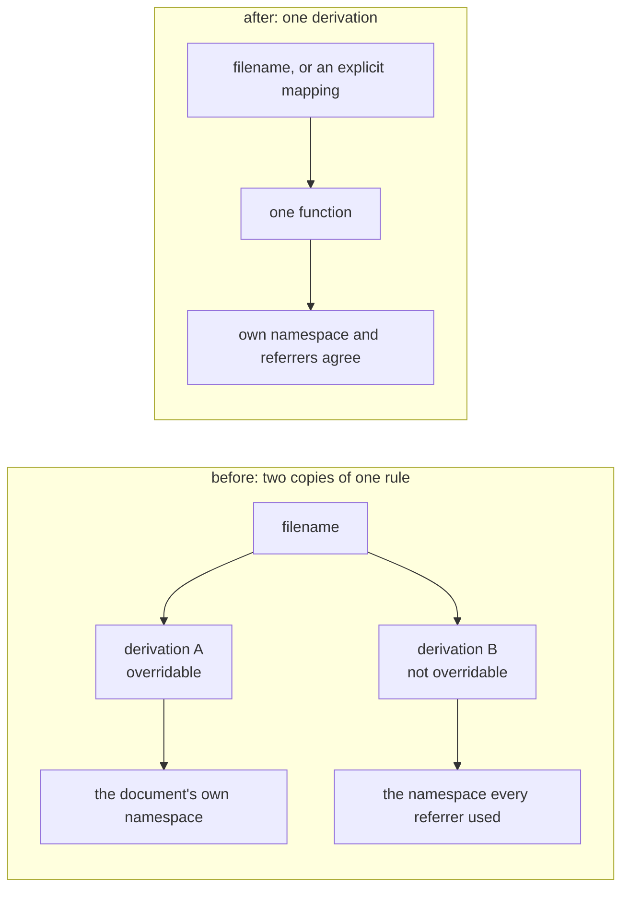
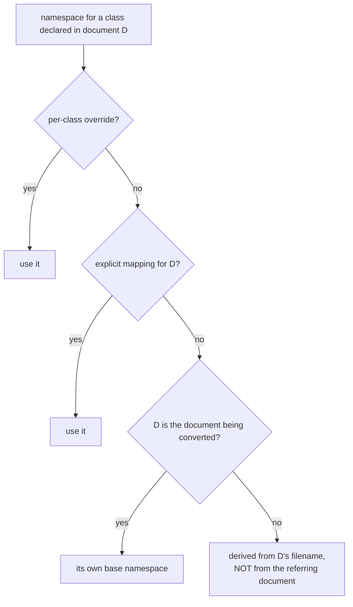
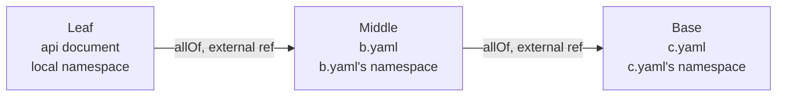
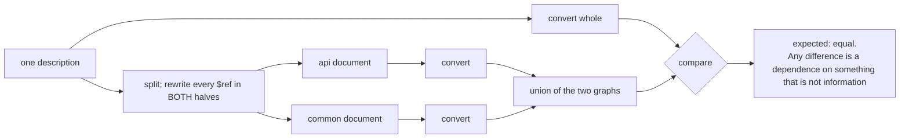

# 4. Multi-document descriptions

## 4.1 What the standard says, and what implementations do

The OpenAPI Specification is explicit that a multi-document description is *one* description: *"each
document in an OAD MUST be fully parsed in order to locate possible reference targets"*. A `$ref` to
`common.yaml#/components/schemas/Addressable` is therefore a reference to `Addressable` — a thing — and
`common.yaml` is where it happens to be written down.

The natural implementation treats the file as the unit of identity instead. It is the default failure,
and this chapter is about what it cost and what replaced it. Three separate defects came from the same
root, and they are worth separating because they were found at different times, by different
instruments, and needed different fixes.

## 4.2 A class's identity belongs to its declaring document

**What went wrong.** A document's namespace was derived in two places by two functions with identical
bodies, only one of which an explicit `base_namespace` argument could override. Supplying the argument
therefore desynchronised a document from every document that referred to it: the declaring document
minted a class under the namespace it was given, while every referrer re-derived one from the
*filename* and minted an IRI that nothing declared.

**What it cost, observed.** On the committed 3GPP output tree of the time — 38 documents, 15,139
triples — 34 of 46 distinct `rdfs:subClassOf` targets and 141 of 797 distinct `rdfs:range` targets
named an IRI no document declared: **175 distinct dangling class targets**. The control row is what
makes the figure trustworthy: `rdfs:domain` dangled **0 of 889**, because domains are always local, so
an instrument that reports zero there and non-zero above is one that can produce both answers.

*(Provenance: measured once, ad hoc, against a committed output tree that has since been replaced by
regeneration from a different corpus. Not re-derivable, and reported here as history.)*

**The fix** is one derivation, `namespace_for_document`, called by both paths. A class's namespace is
then a function of the document that declares it, not of who is asking.

## 4.3 Where "file layout is not identity" stops being true

An earlier version of this project's design record stated, without qualification, that *file structure
is provenance, never identity*. It is true within one description and false across descriptions, and
the two corpora this tool is measured on are the counterexample pair:

* **TM Forum** is one vocabulary spread over several files. `Addressable` belongs to the family's shared
  namespace wherever it is written down; a carve into `common.yaml` is packaging. A class must get the
  *same* IRI whether inlined or split out.
* **3GPP** is one vocabulary *per specification*. `TS28623_ComDefs.yaml` is not packaging — the
  filename encodes the specification number, which is the real identifier. Its classes are correctly
  minted under `…/TS28623/ComDefs#`, and the 38-then-44 documents join up *because* a class carries its
  declaring document's namespace.

Nothing in an OpenAPI document says which case applies. So it is an **input** — `document_namespaces`,
a map from document to namespace — and not a derivation. The default when the caller says nothing is
the declaring document's own derived namespace: the only answer that needs no instruction.

**The default was specified wrongly first, and the cost is instructive.** The design record initially
said an unlisted external document should fall back to the *referring* document's namespace, on the
argument that this is right for the split model. Implemented as written, dangling class targets on the
3GPP corpus went from **16 to 79** under one measurement script — 63 new danglers, all of the shape
`…/TS28541#Top` where `Top` is really declared in `…/TS28623/GenericNrm#Top`. The reasoning was correct
for one corpus and the default applied to both. It was caught by a reviewer re-running the measurement
over the second corpus, not by the test that was supposed to guard it: that test asserted a substring
of the IRI, which accepts any namespace.

## 4.4 External schemas must be registered, not only resolved

The second defect is independent of the first. `build_mapping` built its `classes`, `parents` and
`declared_by` indexes by iterating the **local** document's schemas only. An external ancestor
therefore had no entry in any of them, and the ancestry walk that decides *which class declares this
property* terminated at the document boundary.

The consequence is easy to state. `PolicyRef` composes `Addressable` by an external `$ref`; the walk
stopped at `EntityRef`; and `href`, `id` and `@type` — which `PolicyRef` restates — were attributed to
`PolicyRef` instead of the ancestor that declares them. Each such attribution mints a *second* IRI for
one field. **34 `(class, property)` pairs on a correctly split TMF620.**

Two things about how this was found are worth keeping.

* **The reproduction that circulated with the original request did not reproduce the defect.** It moved
  half of `components/schemas` into `external_schemas` without rewriting the `$ref` strings, so the
  references stayed *internal* and dangling, `external_schemas` was never consulted, and the failure was
  the expected one — an absent ancestor — rather than the one being reported. Any test written from it
  would have been decoration. A split has to rewrite the `$ref`s, **in both halves**: a moved schema may
  refer back to one that stayed.
* **The fixture must restate an inherited property.** A minimal two-document fixture attributed its one
  property correctly, because nothing was restated. TM Forum restates `href`, `id` and `@type`
  constantly; that is what the corpus exposes and a hand-written minimal case does not.

Registration is transitive, each external class is minted under *its own* document's namespace, and a
`#/…` reference inside an external document resolves against **that** document's schemas — getting the
last one wrong is how transitivity silently half-works. On a name collision the **local schema wins**
and the skipped external is reported; 49 of 1,741 3GPP schema names were declared in more than one
document, and 44 of those 49 had differing definitions, so a bare-name index genuinely cannot hold both.

## 4.5 Every determination has to apply on the external path

The third defect is the most general, and it appeared three times.

The library's determinations — *a `*Ref` resolves to its referent*, *a `oneOf` union expands into its
members*, *an alias of a primitive is a datatype* — were each implemented against the local `$ref`
syntax (`#/components/schemas/X`). A reference to another document, `common.yaml#/components/schemas/X`,
is **the same fact in a different syntax**, and the code had two separate paths for the two, only one of
which was complete. Splitting a description converts internal references into external ones wholesale,
so it disabled each determination for exactly the references that moved.

Measured consequences:

* the same property's range was `Agreement` when `AgreementRef` was local and `AgreementRef` when it was
  external — one determination, two answers, decided by file layout;
* an external alias of a primitive (`Tac: {type: string, pattern: …}`) reported `datatype=None`, which a
  consumer reads as "not a literal": **216 datatype disagreements** across the 44 3GPP documents, split
  in two and compared against the whole, **0 after the fix**;
* the `is_iri_valued` half of the same blindness has **no measured instance** in the corpus — no 3GPP
  document puts `format: uri` on a cross-referenced alias — and is a latent defect fixed defensively.
  Stated plainly, because a fix without an instance must not be reported as though it had one.

The cleanest way to see the general point: **a rule that is correct on one syntax and silently absent
on its synonym is a hazard that scales with how much the description is split.** The remedy is not to
patch each rule but to make every one of them resolve through a single reference-following function.

## 4.6 Splitting a description as a differential test

A split cannot change the information in a description. So whole-versus-split is a differential test
whose expected result is known in advance — equality — which means it needs no oracle and finds defects
nobody was looking for. That is its value, and it earned it repeatedly.

It found defects **in the single-document path**, which no single-document test had. On TMF620 converted
*whole*, 45 of 275 `rdfs:range` axioms named a class no document declared, all 45 convention-minted
referents (§2.4). The same comparison exposed the comment accumulation of §2.6.

It is also the reason a number of hypotheses got refuted. The current classification, from
`scripts/diagnose_split_divergence.py` over all 44 3GPP documents (artifact dated 2026-09-28, every
differing triple accounted for):

| cause | triples | what it is |
|---|---|---|
| `range_dangling` | 34 | the split emits a range pointing at nothing; the whole was right. The alias defect (§6) |
| `range_corrected` | 23 | the whole used a datatype and the split names a class **that is declared** — the split is right |
| `vanished_unscoped` | 5 | inline-object properties; one document |
| `range_degraded` | 4 | the whole names a class and the split falls back to a datatype — the one bucket where the split is genuinely worse |
| `other` | 3 | unexplained, kept as a bucket so the classification cannot claim completeness it lacks |
| `vanished_scoped` | **0** | a class-scoped property dropped by splitting |

Read the last row first. `vanished_scoped` was, for five days, the recorded *explanation* for why the
two conversions differed — a rule suppressing an external class's declarations could orphan a property
so that neither half emitted it. **It has zero instances.** It had been inferred from a direction (a net
loss of triples) and the direction had a different cause. That one bucket being empty is the most
useful sentence in this chapter.

Two cautions on the numbers.

* **The gate itself was wrong.** An earlier isomorphism check reported 0 of 46 documents isomorphic and
  could not have reported otherwise: a provenance triple added to every output meant a split always
  carried exactly one more triple than the whole. The comparison, not the graph, was at fault. It is
  now partitioned out and asserted to be exactly `+1` per document, so a change to the stamp cannot put
  the problem back silently.
* **Two committed scripts, two definitions of "diverges".** `measure_split_isomorphism.py` and
  `diagnose_split_divergence.py` do not report the same document counts and are not meant to; one asks
  whether two graphs are isomorphic, the other classifies every differing triple. Neither number is the
  other's denominator, and this document does not reconcile them.
* **The table's totals do not match the repository's prose.** The counts above are lost triples
  summed from the committed artifact: 69 lost and 71 gained. `HYPOTHESES.md` quotes 79 differing
  triples for the same measurement after the same fix, with a different split between buckets. They are
  evidently different runs of a script whose inputs kept changing, and the discrepancy is unresolved
  here. Treat the *ordering* of the buckets — dangling and corrected ranges dominating, scoped
  vanishing at zero — as the finding, not any single count.

## 4.7 A residual, and the drift behind it

One cause remains for the dangling ranges: the SHACL emitter's `_determine_property_type_and_range`
re-derives the range itself for an external `$ref` instead of reading the `Mapping`. Its comment said
the `Mapping` "sees no external schema at all" — true when written, false since `external_schemas`
landed, and the two implementations drifted. That is exactly the failure §1 exists to prevent.

An attempt to reroute that branch through the `Mapping` made things much worse — divergence went from
69 to 984 triples, 917 unexplained — and was reverted. So the reroute is not a one-line change: the
emitter's fallbacks interact with paths the `Mapping` does not cover, and the honest position is that
the drift is *located* and not *resolved*.
